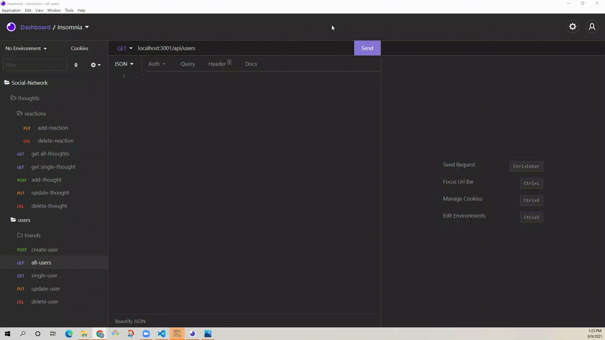

# Social-Network-Backend

## Description:

This is a noSQL application using MongoDB. Since this app is designed for a social networking platform, the app connects to API endpoints for Users, their thoughts, and their friends' reactions to those thoughts and add data to database accordingly.

# Table of Contents

- [Installation](#installation)
- [Usage](#usage)
- [Technologies Used](#languages)
- [Contact](#questions)

## Installation

Node.js and MongoDB are required to run the application on local machine. Clone the repository to a desired location, navigate to the root of application and run `npm ci` on the terminal to install all required dependecies.

## Usage:

The application does not have a front-end, thus the functionality can be seen on Insomnia core, or any other front-end simulator applications. Start the server with `npm start` and simulate the desired fetch requests. Here are the endpoints used:

1. **Users and friends**

- `/api/users`
  - `GET` all users,
  - `POST` new user,

- `/api/users/:userId`
  - `GET` one user by id,
  - `DELETE` remove user,
  - `PUT` update user info,
  - `POST` add a thought of that user,

- `/api/users//:userId/friends/:friendId`
  - `PUT` add friend,
  - `DELETE` remove friend,

2. **Thoughts and reactions**

- `/api/thoughts`

  - `GET` all thoughts,

- `/api/thoughts/:thoughtId`
  - `GET` one thought by id,
  - `DELETE` remove thought,
  - `PUT` add reaction to that thought,

- `/api/thoughts//:thoughtId/:reactionId`
  - `DELETE` remove reaction,

[Link to Full Walkthrough Video](https://youtu.be/mdCOlNcpuAI)

## Technologies Used:

- JavaScript
- Node
- Express
- MongoDB
- Mongoose
- Insomnia Core

## Questions:

Author: _Victor Lupascu_

If you have any questions, please see my GitHub Page: https://github.com/vitokwolf

Or feel free to reach out by email: victor.lupascu.1985@gmail.com
